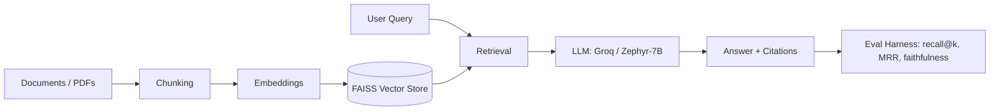

# llm-playbook

Reference implementations and an evaluation harness for RAG and tool-using agent pipelines —
built to compare retrieval strategies and LLM backends under measurable, reproducible conditions,
rather than as one-off scripts.

## What's inside

- **RAG pipelines** — three ingestion/retrieval variants: a baseline FAISS + LangChain pipeline,
  a Groq-backed production pipeline with PDF ingestion, and a chunking/embedding comparison harness.
- **Agent examples** — a ReAct-style tool-using agent and a simple router agent, both with
  basic guardrails (input validation, tool allow-listing).
- **Evaluation harness** — retrieval quality (recall@k, MRR) and answer faithfulness checks,
  runnable locally or in CI.

## Architecture



## Quickstart

**Local**
```bash
python -m venv .venv && source .venv/bin/activate
pip install -e .
cp .env.example .env   # add GROQ_API_KEY
python examples/01_min_rag_cli.py --query "What does this document say about X?"
```

**Docker**
```bash
docker build -t llm-playbook .
docker run --env-file .env llm-playbook python examples/01_min_rag_cli.py --query "..."
```

## Examples

| File | What it demonstrates |
|---|---|
| `examples/01_rag_langchain_faiss_zephyr7b.py` | Baseline RAG: LangChain + FAISS + Zephyr-7B |
| `examples/02_rag_fastapi.py` | RAG served behind a FastAPI endpoint |
| `examples/03_agent_with_tools.py` | ReAct agent with tool-calling and guardrails |

## Evaluation

Run the retrieval evaluation on a 40-question labeled set:

```bash
python -m llm_playbook.eval.retrieval_eval --dataset eval/qa_set.jsonl
```

| Pipeline | Recall@3 | Recall@5 | MRR |
|---|---|---|---|
| Baseline FAISS | _fill in after running_ | | |
| Groq production pipeline | _fill in after running_ | | |

Full methodology and results: [`docs/evaluation.md`](docs/evaluation.md).

## Roadmap

- [ ] Add DBSF fusion comparison against RRF
- [ ] Add answer faithfulness scoring (citation-grounded)
- [ ] CI smoke tests on 5 fixed Q&A pairs

## Author

Sachin Paunikar — [LinkedIn](https://www.linkedin.com/in/sachin-paunikar/) · [Portfolio](https://github.com/ImdataScientistSachin/start-here)
